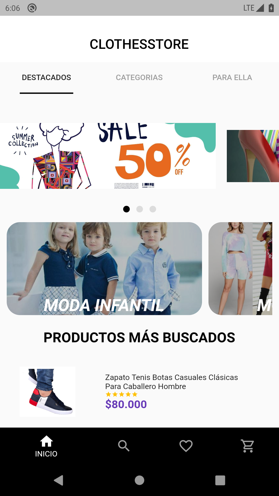
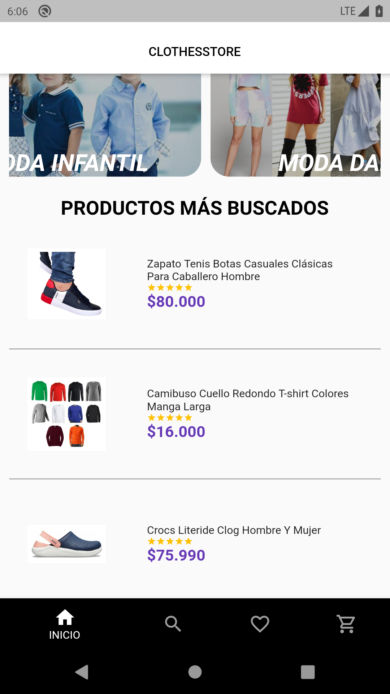
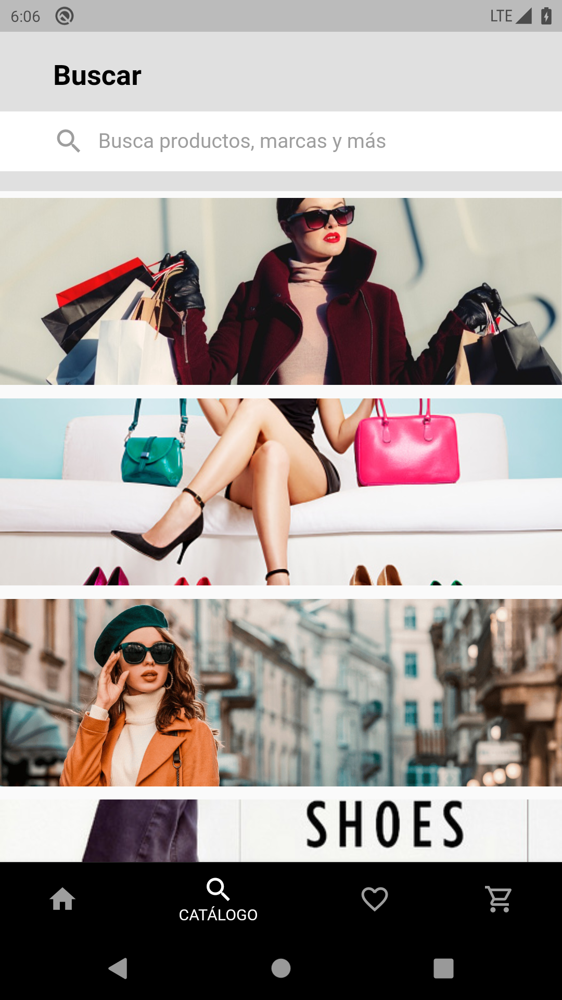
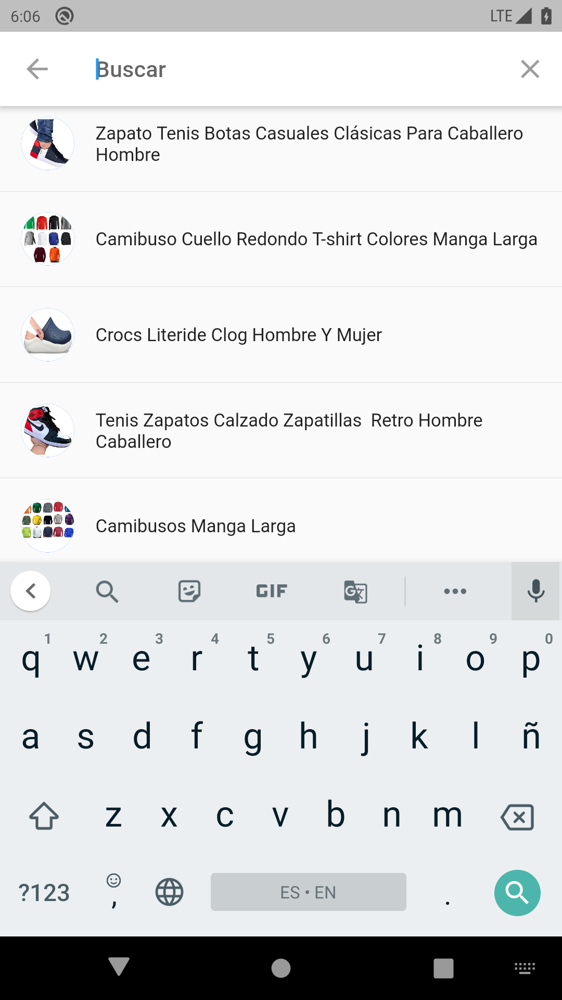
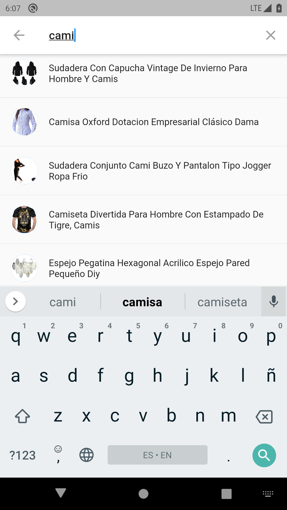
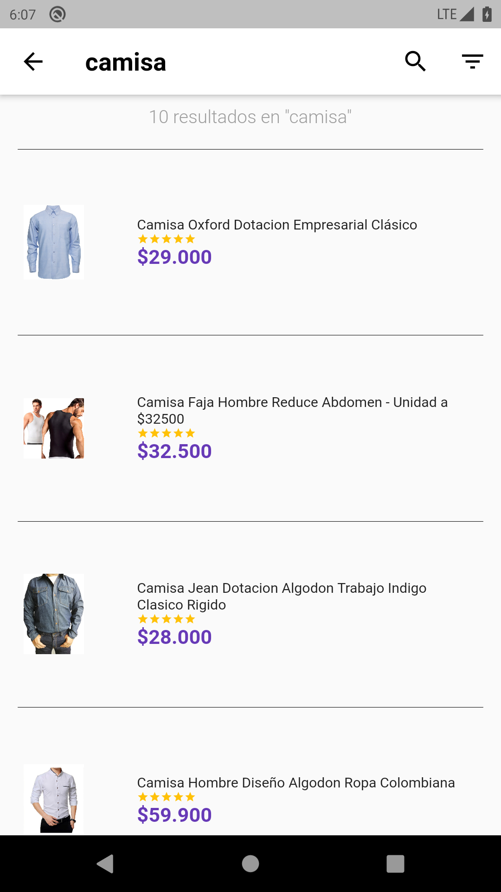
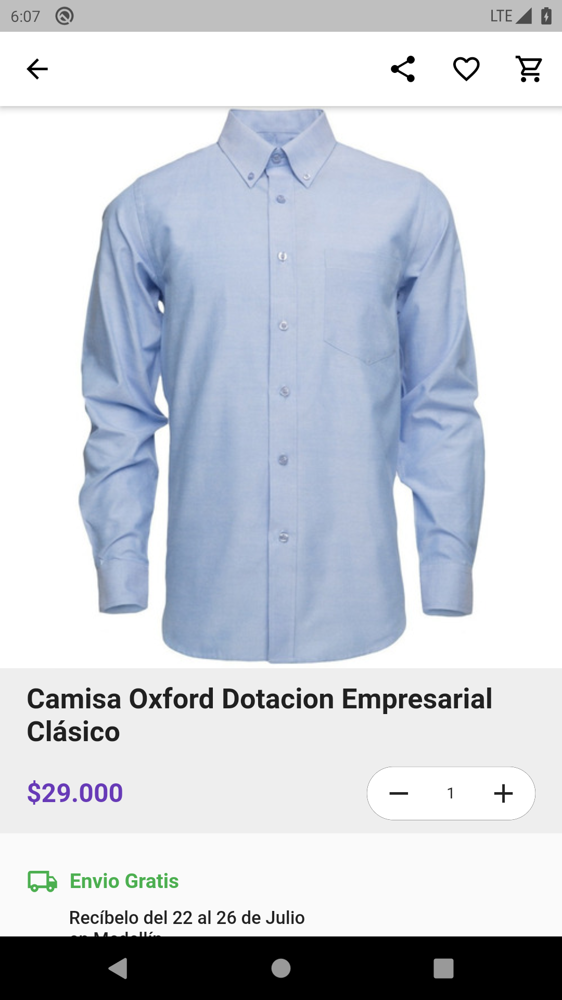
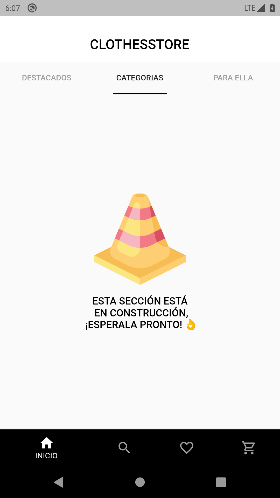
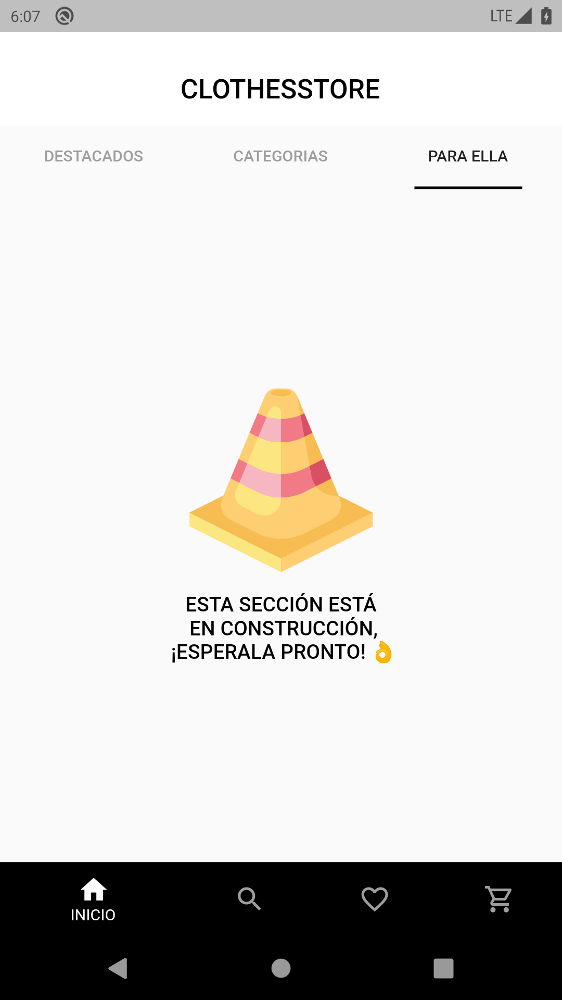

# Contexto

Una compañía emergente llamada Clothesstore LATAM situada en Colombia y dedicada a la venta de productos a través de internet, quiere seguir expandiendo su negocio y fortalecer su canal de venta digital, a través de la construcción de una aplicación móvil que permita vender productos de moda (ropa y accesorios) extraídos desde MercadoLibre.


## Problema

Se requiere desarrollar una aplicación móvil en Flutter que se conecte con la API de MercadoLibre y permita consultar, a través del nombre, cualquier producto de MercadoLibre, en lo posible productos de la categoría moda (ropa y accesorios).

## Principales Instrucciones

**Paso 1:**

Descargar o clonar este respositorio usando este link:


**Paso 2:**

Despues de clonar o descargar el proyecto abralo en VsCode, Android Studio, Intellij o su editor preferido que tenga configurado flutter y correr el comando

```
flutter clean
```
```
flutter pub get
```

**Paso 3:**

corre la aplicacion en un dispositivo movil.

**Paso 4:**

En caso de ejecutar pruebas puede realizarlo con el comando:

```
flutter test 
```

### Anexo imagenes del funcionamiento

  <table>
    <tbody>
    <tr>
        <th><Strong>Demostración</Strong></th>
        <th><Strong>Inicio</Strong></th>
      </tr>
        <tr>
            <td> </td>
            <td> </td>
        </tr>
        <tr>
            <th><Strong>Productos más buscados</Strong></th>
            <th><Strong>Buscador estatico</Strong></th>
        </tr>
        <tr>
           <td> </td>
            <td> </td>
        </tr>
        <tr>
            <th><Strong>Buscador con productos populares</Strong></th>
            <th><Strong>Buscador con sugerencias</Strong></th>
        </tr>
        <tr>
           <td> </td>
            <td> </td>
        </tr>
        <tr>
            <th><Strong>Buscador resultados</Strong></th>
            <th><Strong>Detalles del producto</Strong></th>
        </tr>
        <tr>
           <td> </td>
            <td> </td>
        </tr>
        <tr>
            <th><Strong>Pestaña 'categorias'</Strong></th>
            <th><Strong>Pestaña 'para ella'</Strong></th>
        </tr>
        <tr>
           <td> </td>
            <td> </td>
        </tr>
    </tbody>
  </table>


